# Anwenderdokumentation

## Advanced 3D IDX Viewer

**Dokumentstand:** 29. Juli 2026
**Anwendung:** `idx.html`

Diese Anleitung erklärt die tägliche Bedienung des Advanced 3D IDX Viewers. Sie richtet sich an Anwenderinnen und Anwender aus ECAD, MCAD und der ECAD-/MCAD-Koordination.

Technische Details zum IDX-Datenmodell sind bewusst auf ein Minimum reduziert. Im Mittelpunkt stehen die Fragen:

- Wie lade ich eine Leiterplatte?
- Wie prüfe ich Änderungen?
- Wie finde und bearbeite ich Bauteile?
- Was ist der Unterschied zwischen Ausblenden und Löschen?
- Wie exportiere ich mein Ergebnis?
- Was muss ich vor der Weitergabe kontrollieren?

Eine ausführlichere technische Beschreibung befindet sich in der separaten [Benutzerdokumentation](Benutzerdokumentation.md).

---

## Inhaltsverzeichnis

1. [Der Viewer in Kürze](#1-der-viewer-in-kürze)
2. [Anwendung starten](#2-anwendung-starten)
3. [Schnelleinstieg mit den Beispieldateien](#3-schnelleinstieg-mit-den-beispieldateien)
4. [Aufbau der Oberfläche](#4-aufbau-der-oberfläche)
5. [Baseline laden](#5-baseline-laden)
6. [3D-Ansicht bedienen](#6-3d-ansicht-bedienen)
7. [Bauteile suchen und auswählen](#7-bauteile-suchen-und-auswählen)
8. [Bauteile einblenden, ausblenden oder löschen](#8-bauteile-einblenden-ausblenden-oder-löschen)
9. [Inkremente und Änderungen prüfen](#9-inkremente-und-änderungen-prüfen)
10. [Änderungen annehmen oder ablehnen](#10-änderungen-annehmen-oder-ablehnen)
11. [Bauteile manuell verschieben](#11-bauteile-manuell-verschieben)
12. [Neue Bauteile hinzufügen](#12-neue-bauteile-hinzufügen)
13. [Hintmap und MCAD-Namen](#13-hintmap-und-mcad-namen)
14. [Detaillierte OBJ-Modelle](#14-detaillierte-obj-modelle)
15. [Ergebnis exportieren](#15-ergebnis-exportieren)
16. [Makros verwenden](#16-makros-verwenden)
17. [Empfohlene Arbeitsabläufe](#17-empfohlene-arbeitsabläufe)
18. [Tastatur- und Mausübersicht](#18-tastatur--und-mausübersicht)
19. [Häufige Probleme](#19-häufige-probleme)
20. [Abschlusscheck vor der Weitergabe](#20-abschlusscheck-vor-der-weitergabe)

---

## 1. Der Viewer in Kürze

Der Viewer zeigt IDX-Leiterplattendaten als dreidimensionales Modell. Er kann:

- eine vollständige Ausgangsdatei laden,
- mehrere Änderungspakete nacheinander anzeigen,
- hinzugefügte, gelöschte und verschobene Bauteile hervorheben,
- Bauteile suchen und auswählen,
- Bauteile ausblenden oder für den Export ausschließen,
- Positionen manuell ändern,
- zusätzliche Bauteile einfügen,
- ECAD-Namen über eine Hintmap in MCAD-Namen übersetzen,
- vorhandene OBJ-Modelle als detaillierte Darstellung verwenden,
- einen vollständigen Arbeitsstand oder ein Änderungspaket exportieren.

### Empfohlener Einsatz vor Creo: Komponenten umsortieren und bereinigen

Der [Advanced 3D IDX Viewer](https://niclas85.github.io/IDX-Viewer/) kann verwendet werden, um eine IDX-Datei bereits
vor dem Import in Creo aufzubereiten. Besonders geeignet ist er für:

- das ergonomische Umsortieren von Komponenten per Drag-and-drop oder über die Reihenfolge-Schaltflächen,
- das schnelle Suchen und gleichzeitige Auswählen mehrerer Komponenten,
- das Entfernen nicht benötigter Komponenten über den Papierkorb,
- die visuelle Kontrolle des bereinigten Ergebnisses vor der Übergabe an Creo.

Der browserbasierte Viewer ist für diese Arbeiten in der Regel schneller und ergonomischer als eine nachträgliche
Bereinigung im Creo-Modellbaum. Creo muss dafür nicht gestartet werden. Deshalb wird für das Umsortieren, Prüfen und
Bereinigen im Viewer keine zusätzliche Creo-ECAD/IDX-Lizenz benötigt. Eine gegebenenfalls für den späteren Import
oder weitere ECAD-Funktionen in Creo erforderliche Lizenz ist davon unabhängig.

Empfohlener Ablauf:

1. IDX-Baseline im Viewer laden.
2. Nicht benötigte Komponenten über Suche und Mehrfachauswahl ermitteln.
3. Komponenten per Drag-and-drop oder mit **Ganz nach oben** beziehungsweise **Ganz nach unten** umsortieren.
4. Zu entfernende Komponenten mit dem Papierkorb markieren.
5. Das Ergebnis im 3D-Modell und unter **Aktuelle manuelle Änderungen** kontrollieren.
6. Den bereinigten Stand über **Export** als neue `_filtered.idx`-Datei speichern.
7. Die exportierte Datei anschließend in Creo weiterverwenden.

> **Wichtig:** Das Auge blendet Komponenten nur aus. Nur der Papierkorb kennzeichnet eine Komponente als gelöscht
> beziehungsweise vom exportierten Ergebnis ausgeschlossen. Bewahren Sie die ursprüngliche IDX-Datei unverändert
> auf und verwenden Sie für die Weiterverarbeitung den kontrollierten Export.

### Wichtige Begriffe

| Begriff | Einfache Bedeutung |
|---|---|
| Baseline | vollständiger Ausgangsstand der Leiterplatte |
| Inkrement | Datei mit Änderungen gegenüber einem vorherigen Stand |
| Aktuell | Zustand nach allen geladenen Inkrementen und eigenen Änderungen |
| Response | Antwort auf empfangene Änderungen, beispielsweise eine Ablehnung |
| Hintmap | Zuordnung zwischen ECAD- und MCAD-Namen |

> **Wichtig:** Der Viewer speichert Ihre Sitzung nicht automatisch. Nicht exportierte Änderungen gehen verloren, wenn die Seite neu geladen oder geschlossen wird.

---

## 2. Anwendung starten

### 2.1 Bereitgestellte Webadresse

Die öffentlich bereitgestellte Version ist unter
[https://niclas85.github.io/IDX-Viewer/](https://niclas85.github.io/IDX-Viewer/) erreichbar. Öffnen Sie die Adresse
in Microsoft Edge oder Google Chrome.

### 2.2 Lokal starten

Für eine lokale Verwendung kann im Projektordner ein kleiner Webserver gestartet werden:

```powershell
python -m http.server 8765 --bind 127.0.0.1
```

Öffnen Sie danach im Browser:

```text
http://127.0.0.1:8765/idx.html
```

Der Server kann später im Terminal mit `Strg+C` beendet werden.

### 2.3 Voraussetzungen

Empfohlen werden:

- Microsoft Edge oder Google Chrome,
- aktiviertes JavaScript,
- funktionierende 3D-Grafikunterstützung,
- eine Bildschirmauflösung ab 1280 × 720 Pixel,
- Internetzugriff zum Laden der 3D-Bibliotheken.

### 2.4 Startansicht

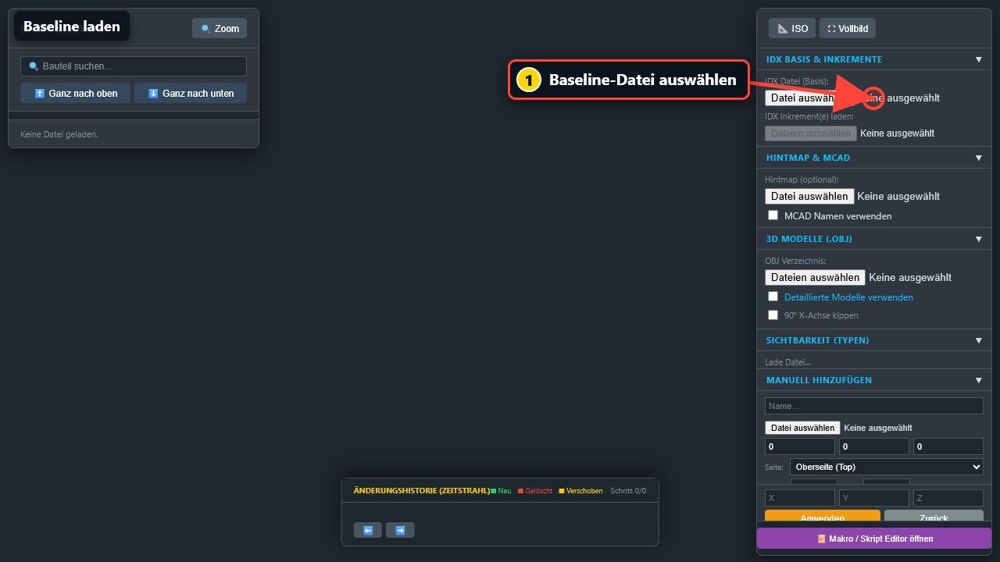

Vor dem Laden einer Datei ist:

- der Modellbaum leer,
- die Auswahl von Inkrementen noch deaktiviert,
- kein Modell in der Mitte sichtbar,
- noch kein Export möglich.

---

## 3. Schnelleinstieg mit den Beispieldateien

Im Ordner `examples` liegen drei Dateien, mit denen der komplette Ablauf ausprobiert werden kann:

| Datei | Verwendung |
|---|---|
| `template.idx` | Baseline |
| `template_increment_1.idx` | erstes Änderungspaket |
| `template_increment_2.idx` | zweites Änderungspaket |

### Schritt-für-Schritt

1. Öffnen Sie den Viewer.
2. Klicken Sie rechts unter **IDX Datei (Basis)** auf **Datei auswählen**.
3. Öffnen Sie `examples/template.idx`.
4. Warten Sie, bis die Platine angezeigt wird.
5. Klicken Sie unter **IDX Inkrement(e) laden** auf **Dateien auswählen**.
6. Wählen Sie beide Increment-Dateien gleichzeitig.
7. Prüfen Sie den Zeitstrahl am unteren Bildschirmrand.
8. Klicken Sie nacheinander auf **Base**, das erste Inkrement, das zweite Inkrement und **Aktuell**.

Nach dem Laden der Baseline zeigt der Viewer beim Beispiel `49 Elemente`. Nach beiden Inkrementen kann der Zähler höher sein, weil auch gelöschte Elemente intern noch zur Änderungshistorie gehören.

---

## 4. Aufbau der Oberfläche

### 4.1 Linke Seite: Modellbaum

Links finden Sie:

- die Bauteilsuche,
- die Reihenfolge-Schaltflächen,
- alle geladenen Bauteile und Board-Elemente,
- das Auge zum Ein- und Ausblenden,
- den Papierkorb zum Ausschließen,
- die Material- oder Artikelnummer,
- die Anzahl der geladenen Elemente,
- **Zoom** für die aktuelle Auswahl.

### 4.2 Mitte: 3D-Modell

In der Mitte wird die Leiterplatte dargestellt. Hier können Sie:

- das Modell drehen,
- hinein- und herauszoomen,
- die Ansicht verschieben,
- Bauteile direkt anklicken,
- Änderungen farblich vergleichen.

### 4.3 Rechte Seite: Dateien und Bearbeitung

Rechts befinden sich:

- **ISO** und **Vollbild**,
- die Export-Schaltflächen,
- Baseline und Inkremente,
- Hintmap und MCAD-Namen,
- OBJ-Modelle,
- Sichtbarkeitsfilter,
- manuelles Hinzufügen,
- Koordinaten der aktuellen Einzelauswahl,
- der Makro-Editor.

Die blauen Abschnittsüberschriften können durch Anklicken ein- und ausgeklappt werden.

### 4.4 Unten: Änderungshistorie

Der Zeitstrahl zeigt:

- die Baseline,
- jedes geladene Inkrement,
- den aktuellen Arbeitsstand,
- die Änderungen des ausgewählten Schritts,
- Schaltflächen zum Annehmen oder Ablehnen,
- eigene manuelle Änderungen.

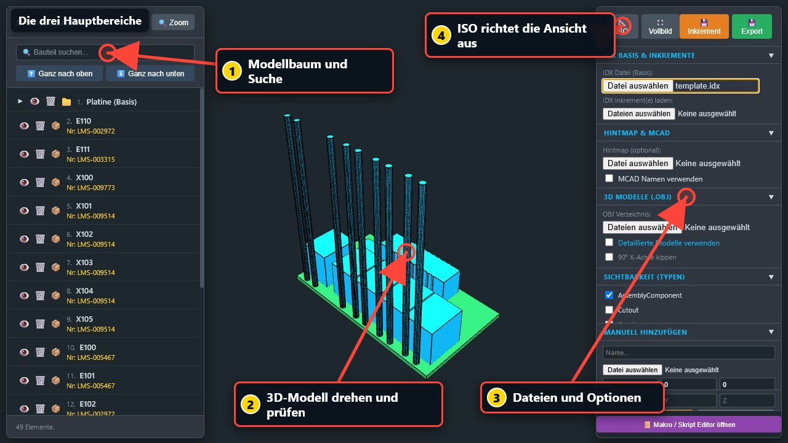

---

## 5. Baseline laden

Eine Baseline ist immer der erste Schritt.

1. Öffnen Sie rechts **IDX Basis & Inkremente**.
2. Klicken Sie bei **IDX Datei (Basis)** auf **Datei auswählen**.
3. Wählen Sie die gewünschte `.idx`- oder `.xml`-Datei.
4. Warten Sie, bis die Meldung **Lade Daten...** verschwindet.

Die wichtigsten Arbeitsbereiche sind im folgenden Bild noch einmal markiert:


### Nach dem Laden kontrollieren

Prüfen Sie:

- Ist die Leiterplatte sichtbar?
- Sind die Abmessungen ungefähr plausibel?
- Sind die Bauteile auf der erwarteten Seite?
- Stimmen bekannte Bauteilnamen und Materialnummern?
- Sind keine auffälligen Körper weit außerhalb der Leiterplatte?
- Werden oben rechts **Inkrement** und **Export** angezeigt?

Wenn das Modell nicht gut zu sehen ist, klicken Sie auf **ISO**.

> **Hinweis:** Das Laden einer neuen Baseline ersetzt den bisherigen Arbeitsstand.

---

## 6. 3D-Ansicht bedienen

| Aktion | Bedienung |
|---|---|
| Modell drehen | linke Maustaste halten und ziehen |
| Zoomen | Mausrad |
| Ansicht verschieben | rechte Maustaste halten und ziehen |
| Bauteil auswählen | kurz mit linker Maustaste anklicken |
| Auswahl aufheben | in einen freien Bereich klicken |

### ISO

**ISO** richtet die Ansicht neu auf alle sichtbaren Elemente aus. Verwenden Sie diese Funktion, wenn:

- das Modell nicht mehr im Bild ist,
- nach dem Ausblenden vieler Elemente zu viel Leerraum sichtbar ist,
- die Kamera sehr nah oder sehr weit entfernt steht.

### Zoom

Wählen Sie ein oder mehrere Bauteile und klicken Sie links auf **Zoom**. Die Kamera wird auf diese Auswahl ausgerichtet.

### Vollbild

**Vollbild** vergrößert den Arbeitsbereich. Mit **Fenstermodus** verlassen Sie ihn wieder.

### Farben der Änderungen

| Farbe | Bedeutung |
|---|---|
| Grün | neu hinzugefügt |
| Rot | gelöscht |
| Gelb | verschoben |
| Blau leuchtend | aktuell ausgewählt |
| Grün beim Board | normale Leiterplattendarstellung |
| Cyan | normales Bauteil |

---

## 7. Bauteile suchen und auswählen

### 7.1 Suche

Geben Sie links in **Bauteil suchen...** einen Namen oder eine Materialnummer ein.

Beispiele:

```text
X100
```

```text
LMS-009514
```

Mit `*` können Sie mehrere ähnliche Einträge finden:

```text
X*
```

```text
*9514*
```

Mit `✖` wird die Suche wieder geleert.

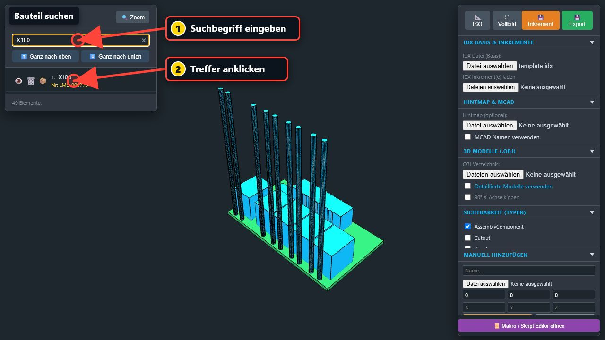

### 7.2 Einzelauswahl

Klicken Sie:

- auf eine Zeile im Modellbaum, oder
- direkt auf ein Bauteil im 3D-Modell.

Das gewählte Bauteil wird blau hervorgehoben. Rechts erscheint der Bereich **Auswahl Verschieben**.

### 7.3 Mehrfachauswahl

- `Strg` + Klick fügt einzelne Bauteile zur Auswahl hinzu oder entfernt sie.
- `Umschalt` + Klick wählt einen zusammenhängenden Bereich.
- `Esc` leert die Auswahl.

### 7.4 Reihenfolge ändern

Ausgewählte Zeilen können mit:

- **Ganz nach oben**,
- **Ganz nach unten**,
- oder per Drag-and-drop

im Modellbaum umsortiert werden.

Das verändert nicht die Position im 3D-Modell.

---

## 8. Bauteile einblenden, ausblenden oder löschen

Dieser Unterschied ist für den Export besonders wichtig.

### 8.1 Auge: nur ausblenden

Das Auge verändert ausschließlich die Anzeige:

- Bauteil wird unsichtbar,
- Daten bleiben erhalten,
- Bauteil bleibt im Export enthalten.

Verwenden Sie das Auge, wenn Sie nur eine übersichtlichere Ansicht benötigen.

### 8.2 Papierkorb: aus dem Ergebnis ausschließen

Der Papierkorb markiert das Bauteil als gelöscht:

- Bauteil wird durchgestrichen,
- Bauteil wird im aktuellen Modell ausgeblendet,
- die Aktion erscheint als manuelle Änderung,
- der Export kann das Bauteil entfernen oder als Löschung melden.

> **Merksatz:** Auge = nur Ansicht. Papierkorb = Datenänderung.

Ein erneuter Klick auf den Papierkorb hebt eine manuelle Löschmarkierung wieder auf.

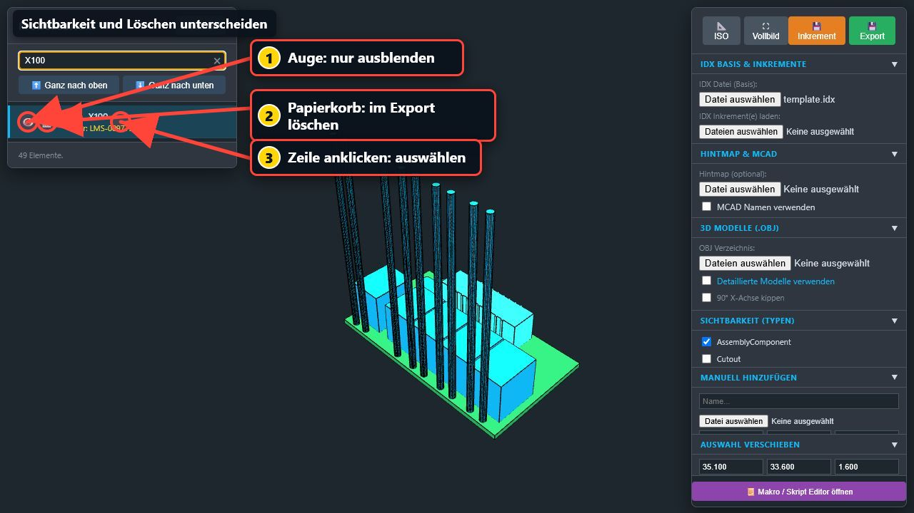

### 8.3 Mehrere Bauteile gleichzeitig

Wenn mehrere Bauteile ausgewählt sind, wirken Auge oder Papierkorb auf die gesamte Auswahl.

Prüfen Sie vor einer Löschung deshalb immer:

- Wie viele Zeilen sind blau markiert?
- Ist noch ein Suchfilter aktiv?
- Soll wirklich die gesamte Auswahl geändert werden?

### 8.4 Sichtbarkeit nach Typ

Unter **Sichtbarkeit (Typen)** können ganze Gruppen ein- oder ausgeblendet werden, zum Beispiel:

- normale Bauteile,
- Ausschnitte,
- KeepIn-Bereiche,
- Durchkontaktierungen,
- Board-Schichten.

Auch diese Typfilter verändern nur die Anzeige, nicht den Export.

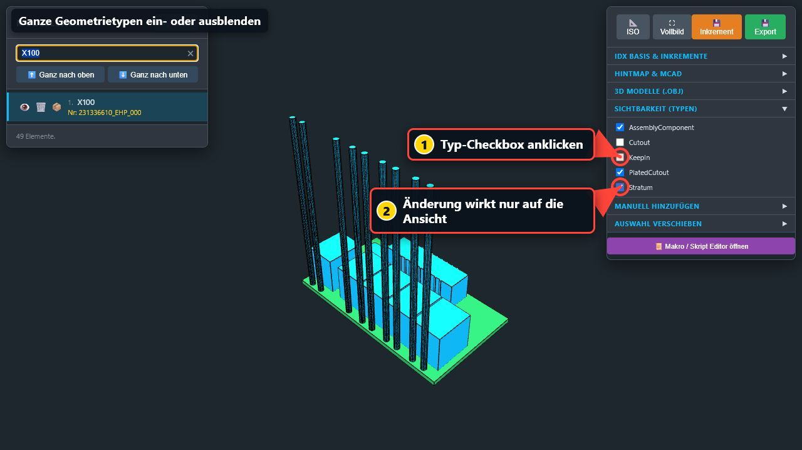

---

## 9. Inkremente und Änderungen prüfen

### 9.1 Inkremente laden

1. Laden Sie zuerst die Baseline.
2. Klicken Sie bei **IDX Inkrement(e) laden** auf **Dateien auswählen**.
3. Wählen Sie alle zusammengehörenden Inkremente gleichzeitig.
4. Warten Sie, bis der Zeitstrahl aufgebaut ist.

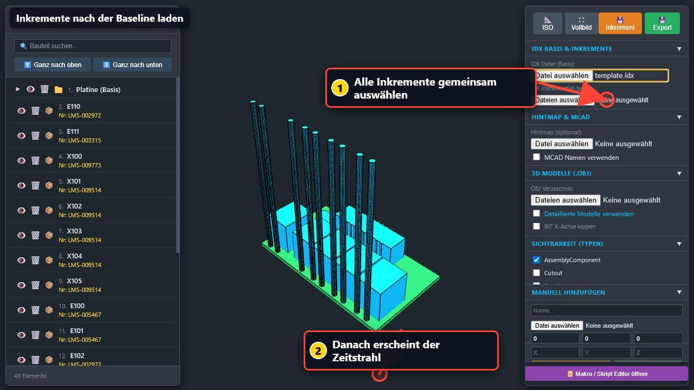

### 9.2 Reihenfolge prüfen

Die Anwendung ordnet Inkremente nach dem gespeicherten Dateidatum. Prüfen Sie deshalb immer, ob die Reihenfolge im Zeitstrahl fachlich stimmt.

Wenn die Reihenfolge falsch ist:

- kontrollieren Sie Datum und Uhrzeit der Dateien,
- verwenden Sie gegebenenfalls Kopien mit korrigierter Zeitreihenfolge,
- laden Sie danach den gesamten Increment-Satz neu.

### 9.3 Zeitstrahl bedienen

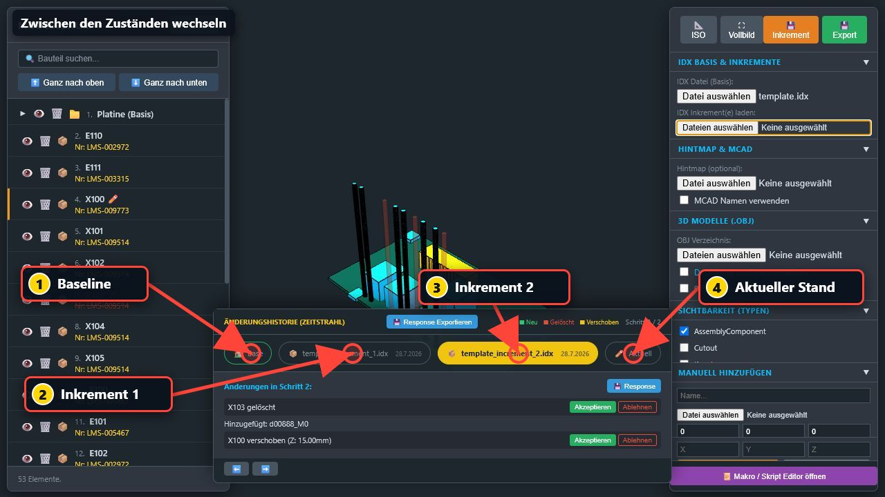

Klicken Sie auf:

- **Base** für den unveränderten Ausgangsstand,
- ein Inkrement für den Zustand nach diesem Änderungsschritt,
- **Aktuell** für den Endzustand einschließlich eigener Änderungen.

Die Pfeile `⬅️` und `➡️` wechseln zwischen Baseline und Inkrementschritten.

### 9.4 Änderungen lesen

Im Detailbereich stehen beispielsweise:

```text
X103 gelöscht
```

```text
Hinzugefügt: d00888_M0
```

```text
X100 verschoben (Z: 15.00mm)
```

Wählen Sie jeden Schritt einzeln und prüfen Sie:

- Welche Bauteile sind neu?
- Welche wurden gelöscht?
- Welche wurden verschoben?
- Ist die neue Position plausibel?
- Gibt es Kollisionen oder ungewöhnliche Abstände?

### 9.5 Beispieländerungen

Das erste Beispiel-Inkrement:

- löscht E104, E105 und E107,
- fügt drei neue Instanzen mit `016144-0000` hinzu,
- verschiebt X101 in Z um 20 mm.

Das zweite Beispiel-Inkrement:

- löscht X103,
- fügt `d00888_M0` hinzu,
- verschiebt X100 in Z um 15 mm.

---

## 10. Änderungen annehmen oder ablehnen

Bei zuordenbaren Änderungen zeigt der Detailbereich:

- **Akzeptieren**
- **Ablehnen**

### Akzeptieren

Mit **Akzeptieren** wird eine zuvor gesetzte Ablehnung wieder aufgehoben. Ohne Ihre Aktion wird eine Änderung in der Anzeige grundsätzlich als angenommen behandelt.

### Ablehnen

Mit **Ablehnen** merkt sich der Viewer, dass diese Änderung nicht übernommen werden soll.

> **Wichtig:** Ablehnen macht die Änderung in der 3D-Ansicht nicht automatisch rückgängig. Ein gelöschtes Bauteil erscheint dadurch nicht wieder und ein verschobenes Bauteil springt nicht an seine alte Position zurück.

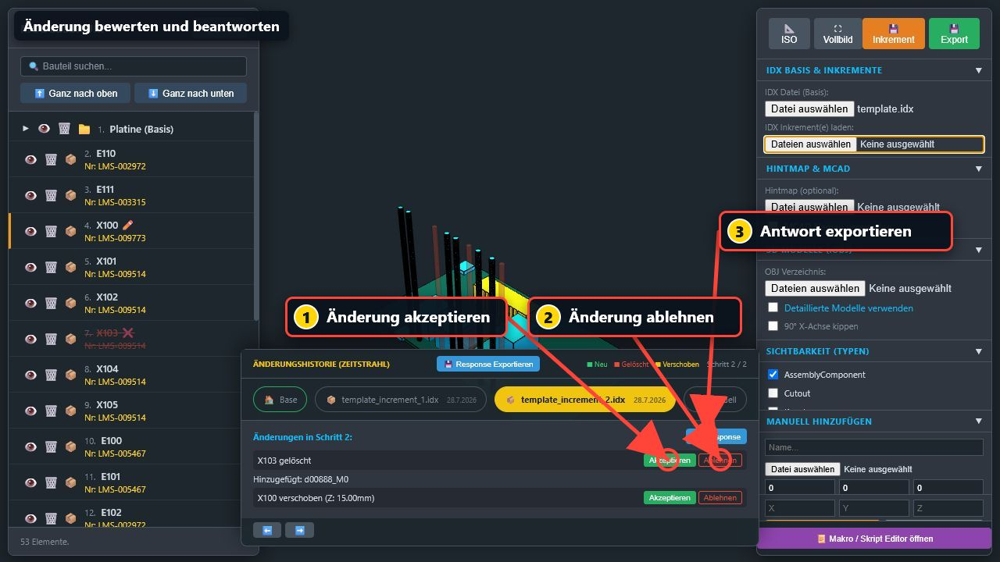

### Neue Bauteile

Neu hinzugefügte Bauteile werden derzeit häufig nur als Textzeile angezeigt. Für diese Zeilen kann eine einzelne Annehmen-/Ablehnen-Schaltfläche fehlen.

### Response exportieren

Mit **Response exportieren** können gespeicherte Ablehnungen ausgegeben werden.

Der aktuelle Download trägt weiterhin einen Namen mit:

```text
_increment.idx
```

Das ist auch dann möglich, wenn Sie den Response-Button verwendet haben. Entscheidend ist der Dateiinhalt.

### Empfohlene Kontrolle

1. Betroffenen Inkrementschritt öffnen.
2. Änderung fachlich und visuell bewerten.
3. Bei Bedarf **Ablehnen** wählen.
4. Auf **Aktuell** wechseln.
5. Falls nötig, einen eigenen Gegenvorschlag als manuelle Verschiebung erfassen.
6. **Response exportieren**.
7. Datei vor der Weitergabe im Zielprozess prüfen.

---

## 11. Bauteile manuell verschieben

1. Wechseln Sie auf **Aktuell**.
2. Wählen Sie genau ein Bauteil aus.
3. Öffnen Sie rechts **Auswahl Verschieben**.
4. Ändern Sie X, Y und/oder Z.
5. Klicken Sie auf **Anwenden**.

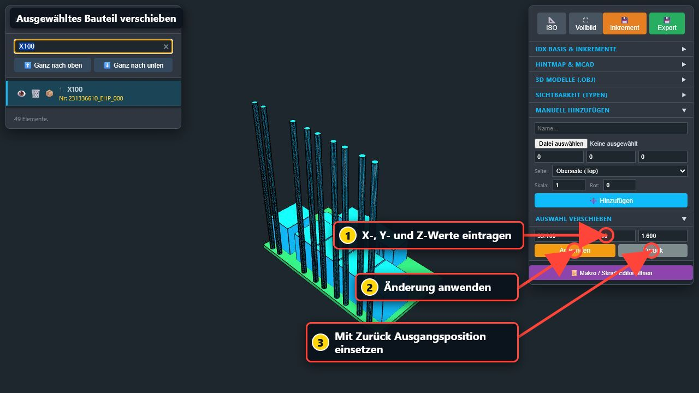

Die Änderung erscheint:

- mit einem Stiftsymbol im Modellbaum,
- unter **Aktuelle manuelle Änderungen**,
- mit dem Unterschied zur vorherigen Position.

Beispiel:

```text
X100 verschoben (X: 4.90mm)
```

### Änderung hervorheben

Klicken Sie im Zeitstrahl auf den Text der manuellen Änderung. Das Bauteil und seine vorherige Position werden hervorgehoben.

### Zurück

**Zurück** setzt das ausgewählte Bauteil auf die Position zurück, die nach dem letzten geladenen Inkrement gültig war.

### Einzelne Änderung verwerfen

Klicken Sie rechts neben dem Eintrag unter **Aktuelle manuelle Änderungen** auf `X`.

### Alle Änderungen verwerfen

Klicken Sie auf **VERWERFEN** und bestätigen Sie die Rückfrage. Alle eigenen Verschiebungen, Ergänzungen und Löschungen werden entfernt.

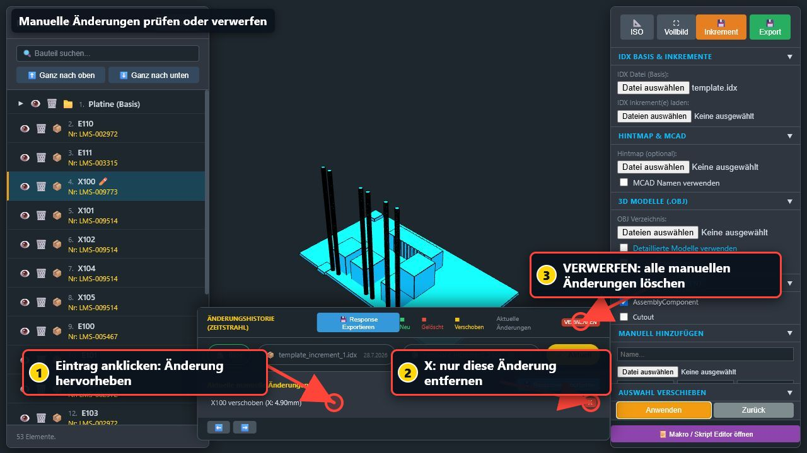

---

## 12. Neue Bauteile hinzufügen

1. Öffnen Sie rechts **Manuell Hinzufügen**.
2. Geben Sie einen Namen ein.
3. Wählen Sie eine OBJ-Datei.
4. Geben Sie X, Y und Z ein.
5. Wählen Sie Top oder Bottom.
6. Stellen Sie bei Bedarf Maßstab und Rotation ein.
7. Klicken Sie **Hinzufügen**.

Ohne OBJ-Datei wird kein Bauteil hinzugefügt.

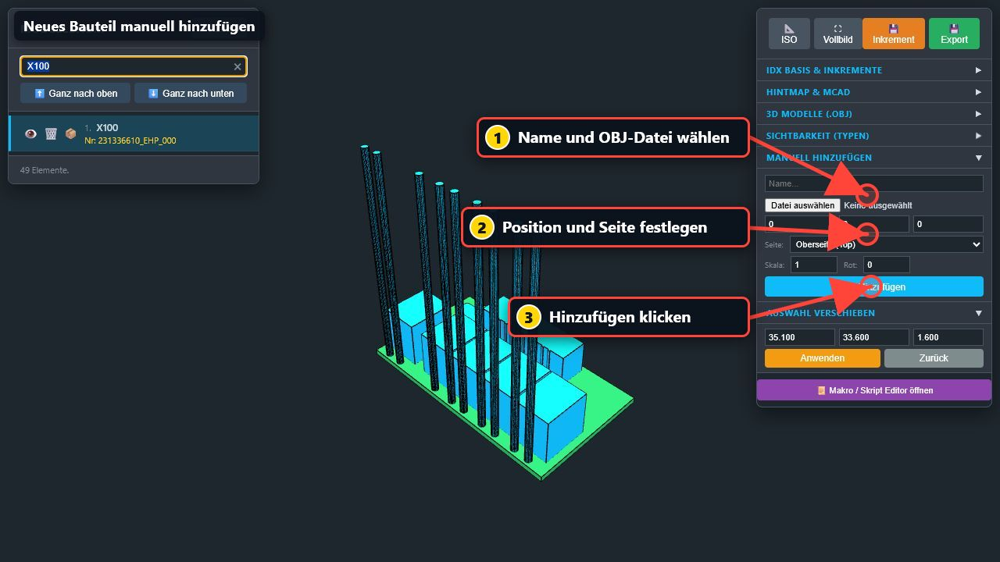

### Eingabefelder

| Feld | Bedeutung |
|---|---|
| Name | Name des neuen Bauteils |
| OBJ-Datei | sichtbares 3D-Modell |
| X, Y, Z | Position |
| Seite | Ober- oder Unterseite |
| Skala | Größe des OBJ-Modells |
| Rot | Drehung der Vorschau |

Das neue Bauteil erhält im Modellbaum ein Sternsymbol.

> **Hinweis:** Prüfen Sie ein manuell hinzugefügtes Bauteil nach dem Export immer im Zielsystem. Die OBJ-Darstellung wird nur vereinfacht in die IDX-Ausgabe übernommen.

---

## 13. Hintmap und MCAD-Namen

Eine Hintmap übersetzt ECAD-Bezeichnungen in vertraute MCAD-Bezeichnungen.

### Hintmap laden

1. Öffnen Sie **Hintmap & MCAD**.
2. Wählen Sie eine `.map`- oder `.txt`-Datei.
3. Prüfen Sie den Mapping-Report.
4. Aktivieren Sie **MCAD Namen verwenden**.

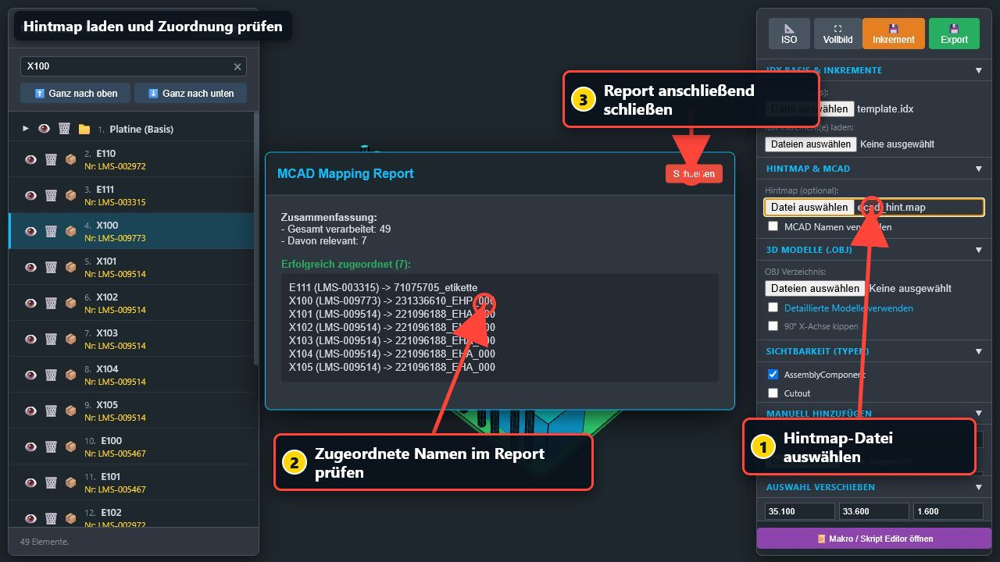

Danach zeigt der Modellbaum die zugeordneten MCAD-Namen, soweit eine Zuordnung vorhanden ist.

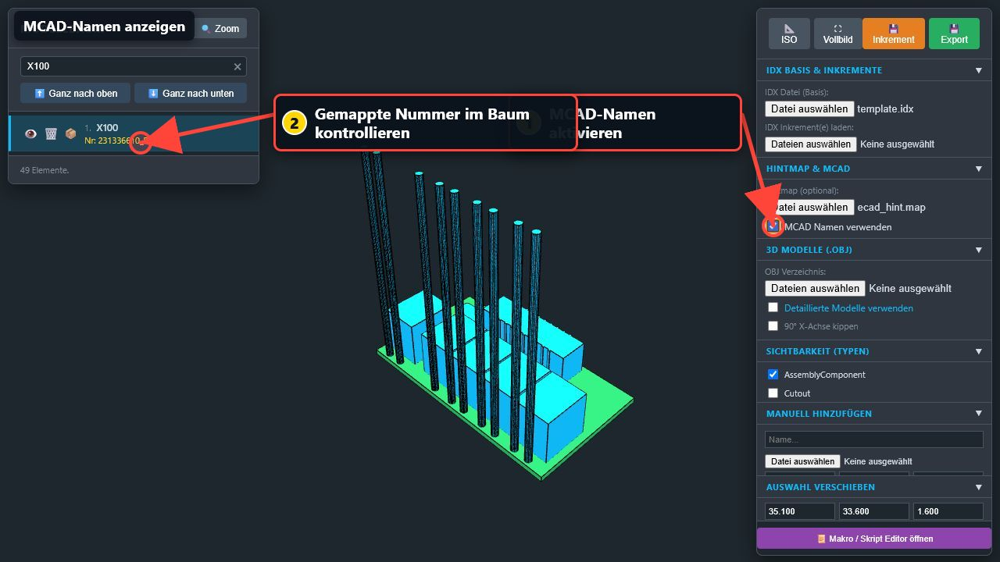

### Was sich ändert

- angezeigte Namen,
- Suchergebnisse,
- Zuordnung von OBJ-Dateien.

Die ursprünglichen Daten der Baseline werden durch das bloße Umschalten nicht umbenannt.

### Wenn Zuordnungen fehlen

Prüfen Sie:

- Ist die richtige Hintmap geladen?
- Stimmen ECAD-Namen exakt?
- Enthält der Report nicht zugeordnete Einträge?
- Wird nach Name oder Materialnummer gemappt?

---

## 14. Detaillierte OBJ-Modelle

OBJ-Modelle ersetzen die einfachen Körper in der Ansicht durch detailliertere Bauteilmodelle.

### Modelle laden

1. Öffnen Sie **3D Modelle (.obj)**.
2. Wählen Sie unter **OBJ Verzeichnis** den Modellordner.
3. Warten Sie, bis der Import abgeschlossen ist.
4. Prüfen Sie den Importreport.
5. Aktivieren Sie **Detaillierte Modelle verwenden**.

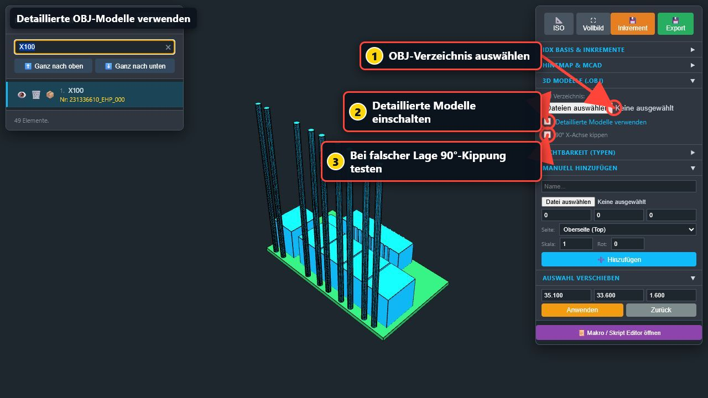

### Dateinamen

Der OBJ-Dateiname muss zum Bauteilnamen oder zur Materialnummer passen, zum Beispiel:

```text
LMS-009773.obj
```

### Falsche Orientierung

Wenn Modelle auf der Seite liegen oder falsch ausgerichtet sind:

1. Aktivieren oder deaktivieren Sie **90° X-Achse kippen**.
2. Prüfen Sie Top/Bottom.
3. Prüfen Sie Maßstab und Einfügepunkt.

OBJ-Modelle verbessern vor allem die Ansicht. Der vollständige OBJ-Inhalt wird nicht in den IDX-Export eingebettet.

---

## 15. Ergebnis exportieren

Nach dem Laden einer Baseline erscheinen oben rechts:

- **Inkrement**
- **Export**

### 15.1 Export

**Export** erstellt einen vollständigen bearbeiteten Arbeitsstand.

Der Dateiname endet auf:

```text
_filtered.idx
```

Verwenden Sie diesen Export, wenn Sie einen möglichst vollständigen aktuellen Stand benötigen.

### 15.2 Inkrement

**Inkrement** erstellt eine Datei mit Ihren neuen Änderungen.

Der Dateiname endet auf:

```text
_increment.idx
```

Die Datei kann enthalten:

- manuelle Verschiebungen,
- manuelle Löschungen,
- manuell hinzugefügte Bauteile,
- gespeicherte Ablehnungen.

Wenn keine neue Änderung vorhanden ist, erscheint:

```text
Keine neuen Änderungen!
```

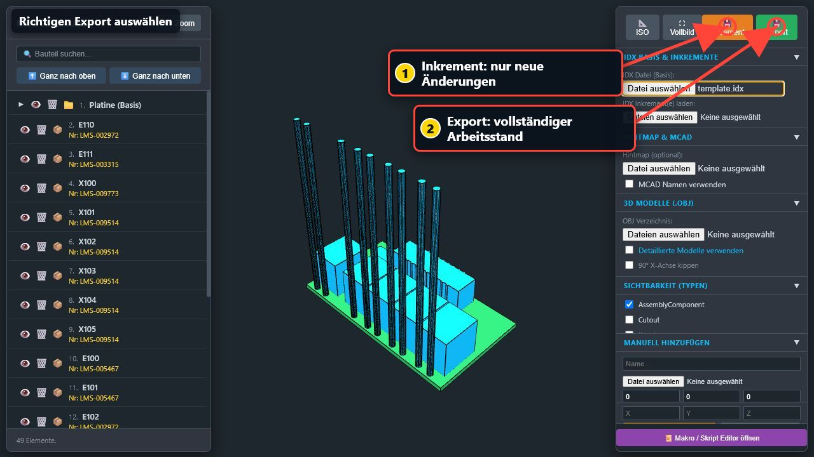

### 15.3 Response

Der Response-Export verwendet technisch denselben Downloadweg wie der Inkrementexport. Deshalb endet auch eine Response-Datei derzeit auf `_increment.idx`.

### 15.4 Welchen Export soll ich verwenden?

| Aufgabe | Schaltfläche |
|---|---|
| vollständigen bearbeiteten Stand speichern | **Export** |
| nur eigene Änderungen weitergeben | **Inkrement** |
| Ablehnung beantworten | **Response exportieren** |
| nur etwas unsichtbar machen | kein Export nötig |

### 15.5 Vor dem Export

Prüfen Sie:

- Sind Sie auf **Aktuell**?
- Sind noch unbeabsichtigte Bauteile ausgewählt?
- Gibt es durchgestrichene Bauteile?
- Stimmen alle manuellen Änderungen?
- Wurden Ablehnungen richtig gesetzt?
- Ist die richtige Baseline geladen?

### 15.6 Nach dem Export

Prüfen Sie:

- Wurde die Datei heruntergeladen?
- Ist der Dateiname plausibel?
- Ist die Dateigröße größer als null?
- Lässt sich die Datei im vorgesehenen Zielsystem öffnen?
- Sind neue, verschobene und gelöschte Bauteile dort korrekt?

---

## 16. Makros verwenden

Der Makro-Editor ist für wiederkehrende Aufgaben und erfahrene Anwender gedacht.

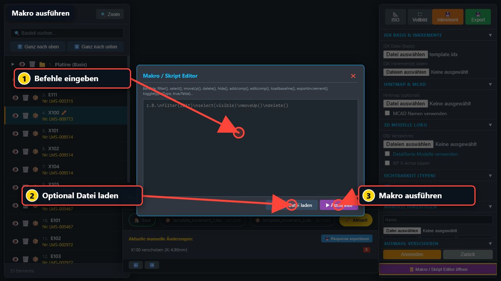

### Makro öffnen

Klicken Sie rechts unten auf **Makro / Skript Editor öffnen**.

Sie können:

- Befehle direkt eingeben,
- eine vorbereitete Textdatei laden,
- das Makro mit **Ausführen** starten.

### Einfaches Beispiel

```text
filter(X100)
select(filter)
editcomp(40, 33.6, 15)
zoom()
```

### Mehrere Bauteile ausblenden

```text
filter(LMS-009514)
select(filter)
hide()
```

### Mehrere Bauteile für den Export löschen

```text
filter(LMS-009514)
select(filter)
delete()
```

### Häufige Befehle

| Befehl | Wirkung |
|---|---|
| `filter(text)` | Suche setzen |
| `select(filter)` | sichtbare Treffer auswählen |
| `deselect()` | Auswahl leeren |
| `hide()` | Auswahl ausblenden |
| `show()` | Auswahl einblenden |
| `delete()` | Auswahl als gelöscht markieren |
| `include()` | Löschmarkierung aufheben |
| `editcomp(x,y,z)` | einzelne Auswahl verschieben |
| `zoom()` | auf Auswahl zoomen |
| `iso()` | Gesamtansicht herstellen |
| `exportbaseline()` | vollständigen Stand exportieren |
| `exportincrement()` | Änderungspaket exportieren |

> **Sicherheitshinweis:** Führen Sie ein neues Makro zuerst ohne Exportbefehl aus. Prüfen Sie Auswahl und Änderungsliste, bevor Sie einen automatischen Export ergänzen.

Die vollständige Befehlsliste steht in der ausführlichen [Benutzerdokumentation](Benutzerdokumentation.md#16-makro--und-skript-editor).

---

## 17. Empfohlene Arbeitsabläufe

### 17.1 Baseline nur ansehen

1. Baseline laden.
2. **ISO** klicken.
3. bekannte Bauteile suchen.
4. bei Bedarf Typen ausblenden.
5. keine Papierkorb-Symbole verwenden.

### 17.2 Änderungen kontrollieren

1. Baseline laden.
2. alle Inkremente gemeinsam laden.
3. Reihenfolge im Zeitstrahl prüfen.
4. jeden Schritt einzeln öffnen.
5. neue, gelöschte und verschobene Bauteile kontrollieren.
6. auf **Aktuell** den Endzustand prüfen.

### 17.3 Änderung ablehnen

1. betroffenen Increment-Schritt öffnen.
2. Änderung prüfen.
3. **Ablehnen** klicken.
4. bei Bedarf eigene alternative Position erfassen.
5. Response exportieren.
6. Datei vor der Übergabe prüfen.

### 17.4 Bestimmte Bauteile nur ausblenden

1. Suchbegriff eingeben.
2. Treffer auswählen.
3. Auge anklicken.
4. Suche leeren.
5. **ISO** klicken.

### 17.5 Bestimmte Bauteile aus dem Ergebnis entfernen

1. Suchbegriff eingeben.
2. Auswahl sorgfältig prüfen.
3. Papierkorb anklicken.
4. unter **Aktuelle manuelle Änderungen** kontrollieren.
5. gewünschten Export erstellen.
6. Ergebnis im Zielsystem prüfen.

### 17.6 Hintmap und OBJ-Modelle verwenden

1. Baseline laden.
2. Hintmap laden.
3. MCAD-Namen aktivieren.
4. OBJ-Verzeichnis laden.
5. Importreport prüfen.
6. detaillierte Modelle aktivieren.
7. Orientierung kritischer Bauteile kontrollieren.

---

## 18. Tastatur- und Mausübersicht

### Tastatur

| Taste | Wirkung |
|---|---|
| `H` | Auswahl ein-/ausblenden |
| `Entf` | Auswahl als gelöscht markieren |
| `Rücktaste` | wie `Entf`, wenn kein Eingabefeld aktiv ist |
| `Esc` | Auswahl leeren |
| `Strg` + Klick | Mehrfachauswahl |
| `Umschalt` + Klick | Bereichsauswahl |

### Modellbaum

| Symbol/Aktion | Wirkung |
|---|---|
| Auge | nur Sichtbarkeit ändern |
| Papierkorb | Löschung für den Export umschalten |
| Pfeil vor Platine | Unterelemente auf-/zuklappen |
| Zeile ziehen | Reihenfolge ändern |
| Zeile anklicken | auswählen |

### 3D-Ansicht

| Aktion | Wirkung |
|---|---|
| kurzer Linksklick | Bauteil auswählen |
| linke Maustaste ziehen | Modell drehen |
| rechte Maustaste ziehen | Ansicht verschieben |
| Mausrad | zoomen |
| freier Hintergrund | Auswahl leeren |

---

## 19. Häufige Probleme

### Die Seite ist leer

- Internetverbindung prüfen.
- Edge oder Chrome verwenden.
- Seite über einen lokalen Webserver öffnen.
- prüfen, ob 3D-Hardwarebeschleunigung aktiviert ist.

### Nach dem Laden ist kein Modell sichtbar

- **ISO** klicken.
- andere IDX-Datei testen.
- prüfen, ob die Datei vollständig und nicht beschädigt ist.
- bei produktiven Daten den Ersteller der Datei kontaktieren.

### Das Modell ist sehr klein oder weit entfernt

- **ISO** klicken.
- bekanntes Bauteil auswählen.
- **Zoom** klicken.
- ungewöhnliche oder weit entfernte Objekte ausblenden.

### Inkremente stehen in falscher Reihenfolge

Der Viewer verwendet die Dateidaten. Kontrollieren Sie Datum und Uhrzeit der Dateien und laden Sie den Satz anschließend neu.

### Ablehnen stellt das Bauteil nicht zurück

Das ist das aktuelle Verhalten. Ablehnen speichert die Antwortentscheidung, führt aber kein automatisches Rückgängigmachen aus.

### Response heißt `_increment.idx`

Das ist der aktuell verwendete Dateiname. Prüfen Sie den Inhalt und die Vorgaben Ihres Übergabeprozesses.

### „Keine neuen Änderungen!“

Es wurde keine eigene Verschiebung, Löschung, Ergänzung oder Ablehnung gefunden.

### OBJ wird nicht zugeordnet

- Dateiname prüfen.
- Materialnummer prüfen.
- Hintmap zuerst laden.
- Importreport lesen.
- sicherstellen, dass die Datei auf `.obj` endet.

### Manuelles Hinzufügen funktioniert nicht

In der normalen Oberfläche muss eine OBJ-Datei ausgewählt sein.

### Änderungen sind nach dem Neuladen verschwunden

Es gibt keine automatische Sitzungsspeicherung. Ergebnisse müssen vor dem Neuladen exportiert werden.

### Exportdatei ist nicht auffindbar

- Downloadordner des Browsers prüfen.
- Browser-Downloadanzeige öffnen.
- blockierte Downloads freigeben.
- nach `_filtered.idx` oder `_increment.idx` suchen.

---

## 20. Abschlusscheck vor der Weitergabe

### Daten

- [ ] Richtige Baseline geladen
- [ ] Alle benötigten Inkremente geladen
- [ ] Reihenfolge der Inkremente geprüft
- [ ] Endzustand unter **Aktuell** kontrolliert

### Änderungen

- [ ] Alle Verschiebungen plausibel
- [ ] Keine unbeabsichtigten Löschungen
- [ ] Ausblenden und Löschen nicht verwechselt
- [ ] Manuell hinzugefügte Bauteile geprüft
- [ ] Ablehnungen korrekt gesetzt

### Darstellung

- [ ] Top-/Bottom-Seite plausibel
- [ ] Keine auffälligen Ausreißer
- [ ] OBJ-Modelle richtig ausgerichtet
- [ ] Board und Bauteile vollständig sichtbar

### Export

- [ ] Richtige Exportart gewählt
- [ ] Datei erfolgreich heruntergeladen
- [ ] Dateiname und Dateigröße geprüft
- [ ] Ergebnis im vorgesehenen Zielsystem getestet
- [ ] Ausgangsdateien und Export gemeinsam archiviert

---

## Kurzübersicht

| Ich möchte … | Aktion |
|---|---|
| eine Leiterplatte öffnen | Baseline laden |
| Änderungen nachvollziehen | Inkremente laden und Zeitstrahl verwenden |
| ein Bauteil finden | Suche links |
| ein Bauteil nur verstecken | Auge |
| ein Bauteil aus dem Ergebnis entfernen | Papierkorb |
| mehrere Bauteile wählen | `Strg` oder `Umschalt` + Klick |
| ein Bauteil verschieben | **Aktuell** → auswählen → Koordinaten → **Anwenden** |
| eine Änderung ablehnen | Inkrementschritt → **Ablehnen** |
| vollständigen Stand speichern | **Export** |
| nur eigene Änderungen speichern | **Inkrement** |
| eine Antwortdatei erzeugen | **Response exportieren** |
| Ansicht wiederfinden | **ISO** |
| Auswahl groß anzeigen | **Zoom** |
